# RocketMQ 基础

## RocketMQ 简介

> RocketMQ是一款高性能、低延迟、高可靠及具备万亿级消息级别的分布式消息中间件，其采用了以**拉模式**为主，**推模式**为辅的消息引擎，并具有可靠重试、基于文件存储的分布式事务等特性，在阿里巴巴历经了多次双11的考验。现已成为Apache基金孵化项目，未来预计打造为Apache顶级项目。

## RocketMQ vs Kafka vs ActiveMQ

MQ产品  | Client语言 | 协议 | 顺序性 | 过滤 | Server端重试  | 持久化 | 追溯 | 优先级 | 追踪 | 配置化 | 运维工具
------------- | ------------- | ------------- | ------------- | ------------- | ------------- | ------------- | ------------- | ------------- | ------------- | ------------- | -------------
ActiveMQ | Java,.NET,C++,... | Push, JMS, MQTT, AMQP, ... | 独占队列有序 | ✅ | ❌ | 高性能(DB) | ✅ | ✅ | ❌ | 须优化 | ✅
Kafka | Java,Scala,... | Pull, TCP | 分区内有序 | ✅ | ❌ |  高性能(文件) | 支持offset指示 | ❌ | ❌ | kv配置 | 仅命令行
RocketMQ | Java, .NET, C++| Pull,TCP,JMS | 无热点严格有序 | ✅ | ✅ | 高性能，低延迟(文件) | 支持时间戳和offset | ❌ | ✅ | 少量配置 | web及命令行

## RocketMQ 架构设计

### NameServer 集群

> NameServer集群提供轻量的服务发现和路由能力，集群中每个NameServer都会记录完整的路由信息，并提供相应的读写服务，且支持快速的存储扩展。

**NameServer**主要提供两方面的功能：

1. **Broker管理**：接收来自Broker集群的注册请求，并通过心跳检测Broker的存活状态；
2. **路由管理**：每个NameServer都将存有Broker集群的路由信息，及供客户端查询的队列信息。

### Broker 集群

> Broker集群通过提供轻量的Topic和Queue机制来处理消息存储，其支持Push和Pull两种模式，并提供强大的峰值填充和堆积百亿消息容量的能力。除此外，Broker也提供灾难恢复、丰富的指标统计和警报机制，这些在传统的消息中间件里很少见。

**Broker**主要负责消息存储及分发，消息查询，HA的保证，其包含了几个重要的子模块：

+ **Remoting Module**，broker的入口，处理来自客户端的请求；
+ **Client Manager**，管理客户端(生产者/消费者)，并维护消费者的Topic订阅信息；
+ **Store Service**，提供简单的API，用于存储或查询消息；
+ **HA Service**，负责**Broker**Master和Slave之间的数据同步；
+ **Index Service**，通过特定的Key，为消息构建索引，便于提供快速的消息查询。

### Producer 集群

> Producer集群支持分布式部署，Producer通过多种负载均衡模式发送消息到Broker集群，且发送过程支持快速失败及低延迟。

### Consumer 集群

> Consumer集群也支持分布式部署，以Push和Pull的方式获取消息(集群消费和广播消费)，并提供了实时的消息订阅机制。

## RocketMQ 关键特性

### 1.单机支持1万以上持久化队列

RocketMQ中消息存储的逻辑视图：

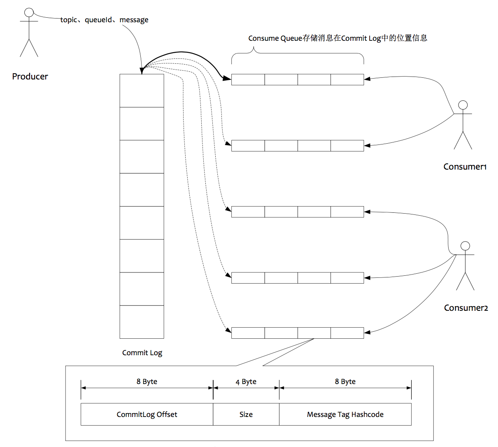

如图所示，消息存储方案大致为：

1. 所有数据单独存储到一个**Commit Log**，完全**顺序写**，**随机读**；
2. 对最终用户可见的消费队列(**Consume Queue**)，实际只存储消息在CommitLog的位置(**offset**)信息，并且**串行方式**刷盘；

这样做的优势在于：

1. 队列轻量化，单个队列数据量非常少；
2. 对磁盘的访问串行化，避免磁盘竟争，并且会因为队列增加导致IOWAIT增高。

但上述方案仍面临几个问题：

1. 对于**Commit Log**，写虽然是**顺序写**，但是读却发成了**随机读**；
2. 读一条消息，会先读**Consume Queue**，再读**Commit Log**，增加了开销；
3. 要保证**Commit Log**与**Consume Queue**完全的一致，增加了编程的复杂度。

如何解决上述几个问题：

1. **随机读问题**：尽可能让读命中**PAGECACHE**，减少IO读操作，所以系统内存越大越好。如果系统中堆积的消息过多，
读数据要访问磁盘会不会由于随机读导致系统性能急剧下降，答案是否定的：

	+ 访问**PAGECACHE**时，即使只访问1k的消息，系统也会提前**预读**出更多数据，在下次读时，就有可能命中内存；
	+ 随机访问**Commit Log**磁盘数据，系统IO调度算法设置为[NOOP](https://en.wikipedia.org/wiki/Noop_scheduler)方式，会在一定程度上将**完全随机读**发成**顺序跳跃方式**，而顺序跳跃方式读较完全的随机读性能会高5倍以上。

2. **读Consume Queue开销问题**：

  + 由亍**Consume Queue**存储数据量极少，而且是**顺序读**，在**PAGE CACHE预读**作用下，**Consume Queue**的读性能几乎不内存一致。所以可认为**Consume Queue**完全不会阻碍读性能。

3. **Commit Log与Consume Queue一致性问题**：

  + **Commit Log**中存储了所有的元信息，消息体，类似亍Mysql、Oracle的**redolog**，所以只要有**Commit Log**在，**Consume Queue**即使数据丢失，仍然可以恢复出来。

### 2.刷盘策略

RocketMQ支持两种刷盘策略：同步刷盘和异步刷盘。

#### 2.1 异步刷盘

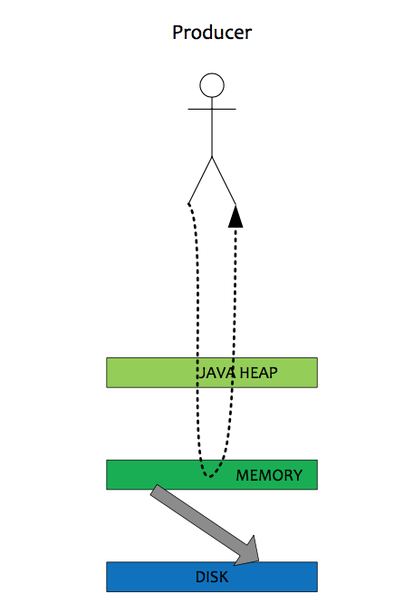

在有RAID卡，SAS 15000转磁盘上测试顺序写文件，速度可以达到300M每秒左右，而线上的网卡一般都为千兆网卡，写磁盘速度明显快亍数据网络入口速度，那是否可以做到写完内存就吐用户迒回，由后台线程刷盘呢?

1. 由亍磁盘速度大亍网卡速度，那么刷盘的速度肯定可以跟上消息的写入速度；

2. 万一由于此时系统压力过大，可能堆积消息，除了写入IO，还有读取IO，万一出现磁盘读取落后情况，会不会导致系统**内存溢出**，答案是否定的，原因如下:

  + 写入消息到**PAGE CACHE**时，如果内存不足，则尝试丢弃干净的PAGE，腾出内存供新消息使用，策略是**LRU**方式；
  + 如果干净页不足，此时写入**PAGE CACHE**会被阻塞，系统尝试刷盘部分数据，大约每次尝试32个PAGE，来找出更多干净 PAGE。

#### 2.2 同步刷盘

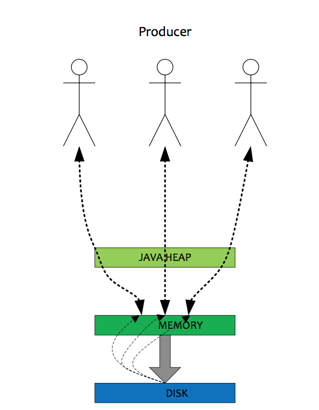

**同步刷盘**与**异步刷盘**的唯一区别是，异步刷盘写完**PAGE CACHE**直接返回，而同步刷盘需要等待刷盘完成才返回，同步刷盘流程如下:

1. 写入**PAGE CACHE**后，线程等待，通知刷盘线程刷盘；
2. 刷盘线程刷盘后，唤醒前端等待线程，可能是一批线程；
3. 前端等待线程吐用户返回成功。

### 3.消息查询

#### 3.1 按照Message Id查询消息

**Message Id**组成：

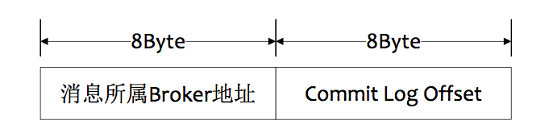

+ **MsgId**总共16字节，包含消息存储主机地址，消息Commit Log offset。从MsgId中解析出Broker的地址和Commit Log的偏移地址，然后按照存储格式所在位置消息buffer解析成一个完整的消息。

#### 3.2 按照Message Key查询消息

**Message Key**索引逻辑结构(类似**HashMap**)：

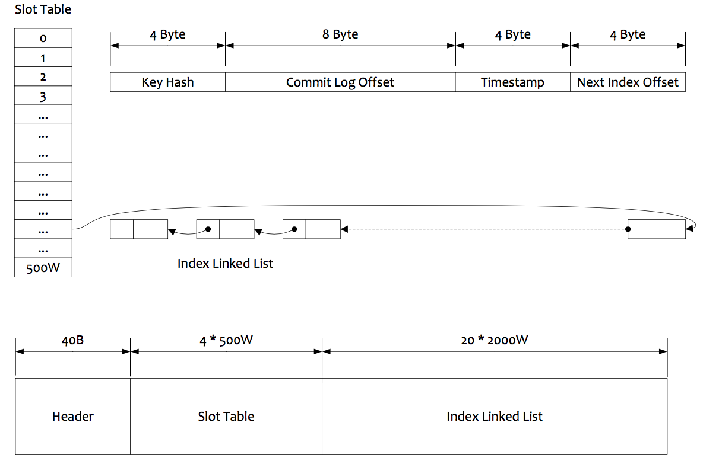

查询逻辑大致如下：

1. 根据查询的key的`hashcode%slotNum`得到具体的槽的位置(**slotNum**是一个索引文件里面包含的最大槽的数目，例如图中所示 slotNum=5000000)；
2. 根据**slotValue**(slot位置对应的值)查找到索引项列表的最后一项(倒序排列，slotValue总是指向最新的一个索引项)；
3. 遍历索引项列表，返回查询时间范围内的结果集(默讣一次最大返回的32条记彔)；
4. **Hash 冲突**；寻找key的slot位置时相当亍执行了两次散列函数，一次key的hash，一次key的hash值取模，因此这里存在两次冲突的情况：
  + 第一种，key的hash值不同但模数相同，此时查询的时候会在比较一次key的hash值(每个索引项保存了key的hash值)，过滤掉hash值不相等的项；
  + 第二种，hash值相等但key不等，出亍性能的考虑冲突的检测放到客户端处理(key的原始值是存储在消息文件中的，避免对数据文件的解析)，客户端比较一次消息体的key是否相同。
5. 存储；为了节省空间索引项中存储的时间是**时间差值**(存储时间-开始时间，开始时间存储在索引文件头中)。

### 4.服务端消息过滤

RocketMQ的消息过滤方式有别于其他消息中间件，是在订阅时，再做过滤，可先看下**Consume Queue**的存储结构：

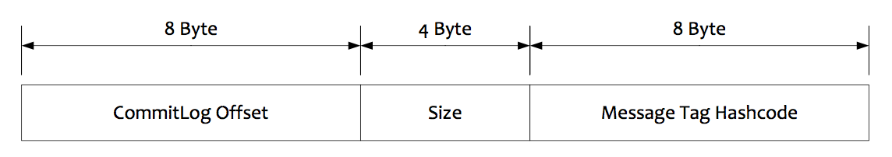

1. 在Broker端进行**Message Tag**比对，先遍历**Consume Queue**，如果存储的Message Tag与订阅的Message Tag不符合，则跳过，继续比对下一个，符合则传输给Consumer(注意：Message Tag是字符串形式，Consume Queue中存储的是其对应的hashcode，比对时也是比对hashcode)；
2. Consumer收到过滤后的消息后，同样也要执行在Broker端的操作，但是比对的是原始的Message Tag字符串，而不是Hashcode。

上面这样做，主要出于以下考虑：

  + Message Tag存储Hashcode，是为了在Consume Queue定长方式存储，节约空间；
  + 过滤过程中不会访问Commit Log数据，可以保证堆积情况下也能高效过滤；
  + 即使Message Tag存在Hash冲突，也可以在Consumer端过滤时进行修正，保证万无一失。

### 5.长轮询 Pull

RocketMQ的Consumer都是从Broker拉消息来消费，但是为了能做到实时收消息，RocketMQ使用**长轮询**方式，可以保证消息实时性同Push方式一致。

> 原理其实比较简单，即在Consumer发起拉取请求后，若服务端未发现有新消息，则将本次请求延迟一段时间再返回给Consumer，若延迟的这段时间内，有新消息产生，会立即返回给客户端。

### 6.顺序消息

#### 6.1 顺序消息原理

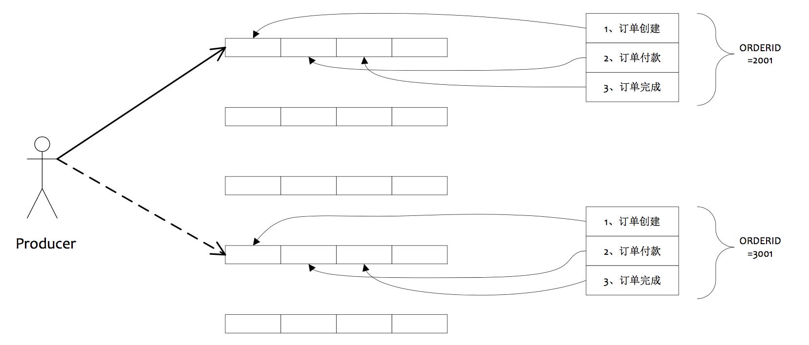

#### 6.2 顺序消息缺点

+ 发送顺序消息无法利用集群**FailOver**特性；
+ 消费顺序消息的并行度依赖于队列数量；
+ **队列热点问题**，个别队列由于哈希不均导致消息过多，消费速度跟不上，产生消息堆积问题；
+ 遇到消息失败的消息，无法跳过，当前队列消费暂停。

### 7.事务消息

事务消息原理图：

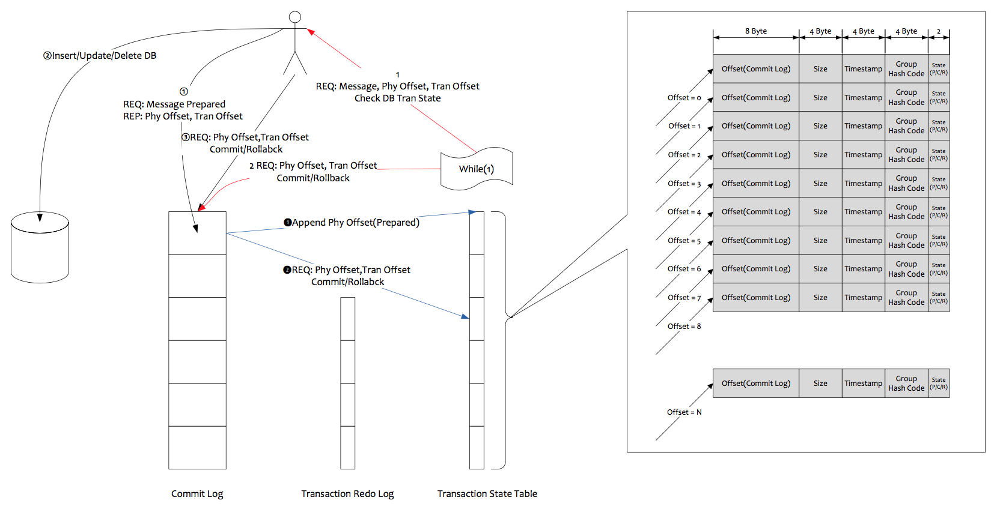

类似于数据库分布式事务，采用**两阶段提交**。不过，还需要在服务端对客户端作**事务回查**，防止一些意外情况，如客户端未提交，也未回滚等。

### 8.发送消息负载均衡

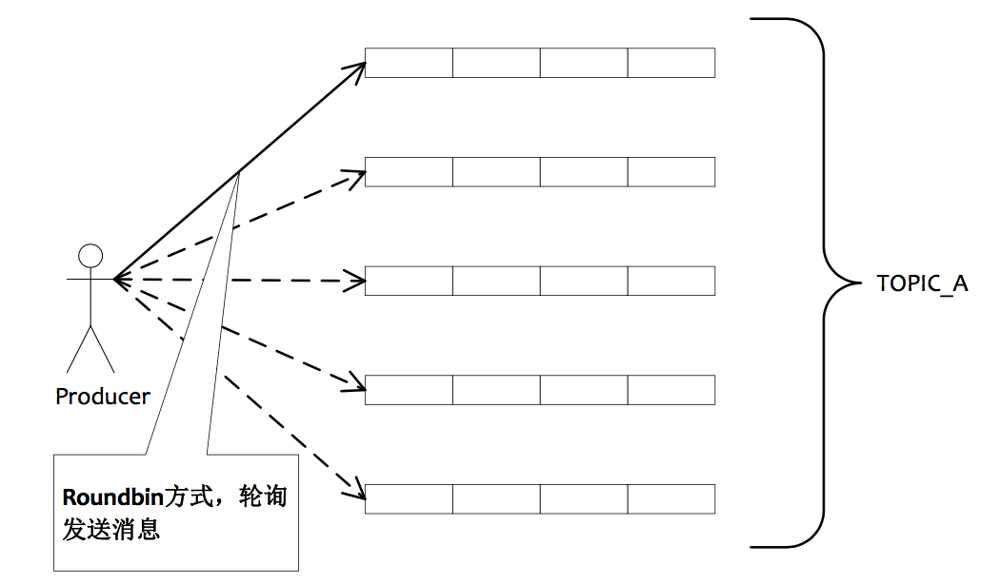

如图所示，5个队列可以部署在一台机器上，也可以分别部署在5台不同的机器上，发送消息通过**轮询队列**的方式发送，每个队列接收平均的消息量。通过增加机器，可以水平扩展队列容量。

### 9.订阅消息负载均衡

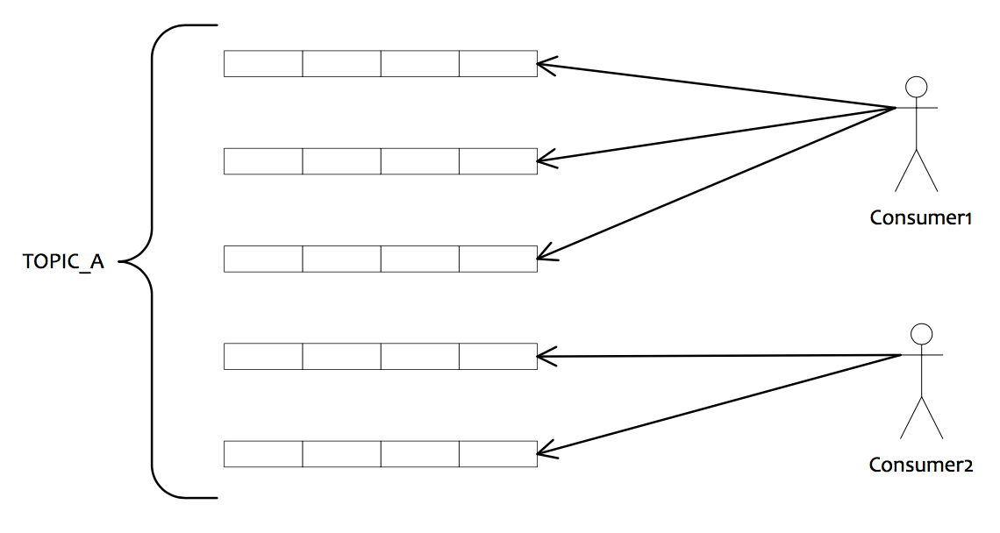

如图所示，如果有5个队列，2个Consumer，那么第一个Consumer消费3个队列，第二个Consumer消费2个队列。这样即可达到平均消费的目的，同样可以水平扩展Consumer来提高消费能力。但是Consumer数量要小于等于队列数量，如果Consumer超过队列数量，那么多余的Consumer将不能消费消息（限于**集群消费模式**下）。

### 10.单队列并行消费

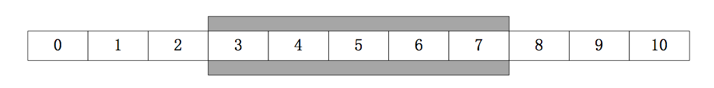

如图所示，单队列幵行消费采用**滑劢窗口**方式幵行消费，在一个滑劢窗口区间的消息，可以由多个线程并行消费，但是每次提交的Offset都是最小Offset，例如3。

### 11.HA，同步双写/异步复制

**异步复制**的实现思路非常简单，Slave启劢一个线程，不断从Master拉取Commit Log中的数据，然后在异步build出Consume Queue数据结构。整个实现过程基本同Mysql主从同步类似。

### 12.消息堆积问题解决办法

衡量消息堆积能力的指标：

| 指标           | 描述          | 
| ------------- | ------------- |
| 消息的堆积容量 | 依赖磁盘大小    |
| 发消息的吞吐量大小受影响程度 | 无SLAVE情况，会受一定影响；有SLAVE情况，不受影响 |
| 正常消费的Consumer是否会受影响 | 无SLAVE情况，会受一定影响；有SLAVE情况，不受影响 |
| 访问堆积在磁盘的消息时，吞吐量有多大 | 与访问的并发有关，最慢会降到5000左右 |

在有Slave情况下，Master一旦发现Consumer访问堆积在磁盘的数据时，会向Consumer下达一个重定向指令，令Consumer从Slave拉取数据，这样正常的发消息与正常消费的Consumer都不会因为消息堆积受影响，因为 系统将堆积场景与非堆积场景分割在了两个不同的节点处理。这里会产生另一个问题，Slave会不会写性能下降，答案是否定的。因为Slave的消息写入只追求吞吐量，不追求实时性，只要整体的吞吐量高就可以，而Slave每次都是从Master拉取一批数据，如1M，这种批量顺序写入方式即使堆积情况，整体吞吐量影响相对较小，只是写入RT会变长。

## 参考文献

+ [Apache RocketMQ背后的设计思路与最佳实践](http://jm.taobao.org/2017/03/09/20170309/)；

+ [专访RocketMQ联合创始人：项目思路、技术细节和未来规划](http://www.infoq.com/cn/news/2017/02/RocketMQ-future-idea)；

+ [RocketMQ官网](https://rocketmq.incubator.apache.org/)；

+ [RocketMQ开发指南](rokectmq_dev_guide.pdf)；

+ [随机读 vs 顺序读](http://www.violin-memory.com/blog/understanding-io-random-vs-sequential/)；

+ [磁盘I/O那些事](https://tech.meituan.com/about-desk-io.html)；

+ [Page Cache Basics](https://www.thomas-krenn.com/en/wiki/Linux_Page_Cache_Basics)；

+ [Page Cache, the Affair Between Memory and Files](http://duartes.org/gustavo/blog/post/page-cache-the-affair-between-memory-and-files/)。