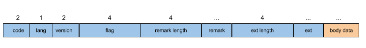

# RocketMQ 通信

RocketMQ中的通信是基于**Netty 4.0.36.Final**，在其上作了一些网络消息封装(即**协议**)，再加上相应的**序列化方式**，即可作**RPC**调用。

### 1.通信协议

RocketMQ中的协议格式，如下图所示：


其实现主要在[Remote](../remoting)模块中，协议通过[RemotingCommand](../remoting/src/main/java/org/apache/rocketmq/remoting/protocol/RemotingCommand.java)类体现，请求(**Request**)和响应(**Response**)均会使用该类：

```java
public class RemotingCommand {

	///// 以下为请求头字段
	
	/**
	 * 请求码，
	 */
	private int code;
	
	/**
	 * 语言类型，可为后期做一些语言特性处理或兼容
	 */
	private LanguageCode language = LanguageCode.JAVA;
	
	/**
	 * 版本号
	 */
	private int version = 0;
	
	/**
	 * 请求ID
	 */
	private int opaque = requestId.getAndIncrement();
	
	/**
	 * 标记
	 */
	private int flag = 0;
	
	/**
	 * 备注
	 */
	private String remark;
	
	/**
	 * 扩展字段
	 */
	private HashMap<String, String> extFields;
	
	/**
	 * 序列化类型，默认为JSON
	 */
	private SerializeType serializeTypeCurrentRPC = serializeTypeConfigInThisServer;
	
	/**
	 * 不同请求类型特性的Header类，序列化时会将对象字段放入extFields
	 */
	private transient CommandCustomHeader customHeader;
	    

	//// 请求body数据
	private transient byte[] body;
	
	// ...
}

```

如上述代码片段，除了`customHeader`和`body`被`transient`修饰，其他字段均可序列化，请求头字段概述：

header字段名    |  Request      | Response      |  说明
-------------  | ------------- | ------------- | -------------
code  | 请求操作码，请求接收方根据该值做不同的操作 | 应答结果码，0表示成功，非0表示各种错误码 | 所有请求码可见[RequestCode](../common/src/main/java/org/apache/rocketmq/common/protocol/RequestCode.java)
language  | 请求方实现语言 | 应答接收方实现语言 | 默认JAVA
version  | 请求发起方程序版本 | 应答接收方程序版本 | -
opaque | 标识一次请求，可用于异步处理 | 应答方不做修改，直接返回 | - 
flag | 通信标志位，如RPC类型，如RPC, 或Oneway | 通信标志位，如RPC类型 | 第一位标识是请求还是响应，第二位标识是否是**Oneway**
remark | 自定义文本信息 | 错误详细描述信息 | -
extFields | 各类请求的自定义字段 | 各类响应的自定义字段 | -

### 2.协议编码与解码(codec)

请求/响应命令编码与解码均在`RemotingCommand`中实现。

#### 2.1 协议编码(encode)

**协议编码**主要在`RemotingCommand`的`encode`方法中实现：

```java
// RemotingCommand.java
public ByteBuffer encode() {

    // 计算整个command需要的字节数
    // header数据长度需要4个字节
    int length = 4;

    // 编码header
    byte[] headerData = this.headerEncode();
    // header真实数据字节数
    length += headerData.length;

    // 3> body真实数据字节数
    if (this.body != null) {
        length += body.length;
    }

    // 申请缓冲区，加上的4个字节用于存放数据总长度
    ByteBuffer result = ByteBuffer.allocate(4 + length);

    // 放入数据总长度
    result.putInt(length);

    // header length = 序列化类型(1 byte) + header数据长度(3 byte)
    // 注意，这里存放header长度的4个字节中，第1个字节存放了序列化类型，剩下3个字节存放header的数据长度，
    // 即header数据长度最大为2^24，即16M
    result.put(markProtocolType(headerData.length, serializeTypeCurrentRPC));

    // 放入header数据
    result.put(headerData);

    // 放入body数据
    if (this.body != null) {
        result.put(this.body);
    }

    // 将ByteBuffer切换到读模式
    result.flip();

    return result;
}

// 编码header数据
private byte[] headerEncode() {

    // 将定制header放入extFields
    this.makeCustomHeaderToNet();

    if (SerializeType.ROCKETMQ == serializeTypeCurrentRPC) {
        // ROCKETMQ序列化
        return RocketMQSerializable.rocketMQProtocolEncode(this);
    } else {
        // JSON序列化
        return RemotingSerializable.encode(this);
    }
}

// 设置扩展头字段
public void makeCustomHeaderToNet() {

    if (this.customHeader != null) {
        // 反射获取请求命令对象自定义的字段
        Field[] fields = getClazzFields(customHeader.getClass());
        if (null == this.extFields) {
            this.extFields = new HashMap<String, String>();
        }

        for (Field field : fields) {
            // 取非static的字段
            if (!Modifier.isStatic(field.getModifiers())) {
                String name = field.getName();
                if (!name.startsWith("this")) {
                    // 非this开头的字段
                    Object value = null;
                    try {
                        field.setAccessible(true);
                        value = field.get(this.customHeader);
                    } catch (IllegalArgumentException e) {
                    } catch (IllegalAccessException e) {
                    }

                    if (value != null) {
                        // 非空，则放入扩展字段
                        this.extFields.put(name, value.toString());
                    }
                }
            }
        }
    }
}

// 设置序列化类型
public static byte[] markProtocolType(int source, SerializeType type) {

    byte[] result = new byte[4];

    // e.g. source = 100 (00000000 00000000 00000000 1100100)

    result[0] = type.getCode();
    result[1] = (byte) ((source >> 16) & 0xFF);
    result[2] = (byte) ((source >> 8) & 0xFF);
    result[3] = (byte) (source & 0xFF);

    // [00000000, 00000000, 00000000, 1100100]
    return result;
}
```

#### 2.2 协议解码(decode)

**协议解码**主要在`RemotingCommand`的`decode`方法中实现：

```java
// RemotingCommand.java
public static RemotingCommand decode(final ByteBuffer byteBuffer) {

    // 数据总长度
    int length = byteBuffer.limit();

    // 序列化类型字节(1 byte) + header长度(3 byte)
    int oriHeaderLen = byteBuffer.getInt();

    // 获取header长度
    int headerLength = getHeaderLength(oriHeaderLen);

    byte[] headerData = new byte[headerLength];
    // 填充header数据
    byteBuffer.get(headerData);

    // 反序列化header数据，并构建RemotingCommand对象
    RemotingCommand cmd = headerDecode(headerData, getProtocolType(oriHeaderLen));

    // body长度
    int bodyLength = length - 4 - headerLength;
    byte[] bodyData = null;
    if (bodyLength > 0) {
        bodyData = new byte[bodyLength];
        // 填充body数据
        byteBuffer.get(bodyData);
    }
    cmd.body = bodyData;

    return cmd;
}

// 获取header真实长度
public static int getHeaderLength(int length) {
    return length & 0xFFFFFF;
}

// 获取序列化类型
public static SerializeType getProtocolType(int source) {
    return SerializeType.valueOf((byte) ((source >> 24) & 0xFF));
}

// 反序列化header，并构建RemotingCommand
private static RemotingCommand headerDecode(byte[] headerData, SerializeType type) {
    switch (type) {
        case JSON:
            // JSON反序列化
            RemotingCommand resultJson = RemotingSerializable.decode(headerData, RemotingCommand.class);
            resultJson.setSerializeTypeCurrentRPC(type);
            return resultJson;
        case ROCKETMQ:
            // RocketMQ反序列化
            RemotingCommand resultRMQ = RocketMQSerializable.rocketMQProtocolDecode(headerData);
            resultRMQ.setSerializeTypeCurrentRPC(type);
            return resultRMQ;
        default:
            break;
    }

    return null;
}
```

<font color="red">注意</font>：在`decode`时，并没有获取对应`encode`后第一个字节(即**数据总长度**)，这是因为**RocketMQ**在使用Netty通信时，定制了解码器[NettyDecoder](../remoting/src/main/java/org/apache/rocketmq/remoting/netty/NettyDecoder.java)，该类继承自**LengthFieldBasedFrameDecoder**(该Decoder很适合用于解析header中含有数据长度的二进制消息)，并且可见其初始化为：

```java
// NettyDecoder.java
public class NettyDecoder extends LengthFieldBasedFrameDecoder {
	
    public NettyDecoder() {
        // 设置前4个字节表示数据总长度，并从第5个字节开始截取数据，并填充buffer
        super(FRAME_MAX_LENGTH, 0, 4, 0, 4);
    }
}
```

### 3.序列化与反序列化

由上文可知，RocketMQ中支持两种序列化：**JSON**和**ROCKETMQ**。

#### 3.1 JSON序列化

**JSON**序列化使用的是**fastjson 1.2.29**。

#### 3.2 ROCKETMQ序列化

**ROCKETMQ**是自定义的一套序列化方式，具体实现可见类[RocketMQSerializable](../remoting/src/main/java/org/apache/rocketmq/remoting/protocol/RocketMQSerializable.java)，格式如图所示：



### 4.RPC调用

上文已述，**RocketMQ**以**Netty**作为网络通信基础，进而封装了一层RPC调用，这里将以**创建Topic**为例，阐述一下整个**RPC请求/响应**的过程。

下面参考[tools](../tools)项目中的[UpdateTopicSubCommand](../tools/src/main/java/org/apache/rocketmq/tools/command/topic/UpdateTopicSubCommand.java)命令的实现：

```java
// UpdateTopicSubCommand.java
public class UpdateTopicSubCommand implements SubCommand {

    // ...
    
    @Override
    public void execute(final CommandLine commandLine, final Options options, RPCHook rpcHook) {
        
        // 构造一个Client API请求实例
        DefaultMQAdminExt defaultMQAdminExt = new DefaultMQAdminExt(rpcHook);
        defaultMQAdminExt.setInstanceName(Long.toString(System.currentTimeMillis()));

        try {
            TopicConfig topicConfig = new TopicConfig();
            
            // ... 从命令行解析各种配置
            // 如topicName，

            if (commandLine.hasOption('b')) {
                // broker地址
                String addr = commandLine.getOptionValue('b').trim();
				    	
                // 启动Client API实例
                defaultMQAdminExt.start();
                
                // 创建或更新Topic
                defaultMQAdminExt.createAndUpdateTopicConfig(addr, topicConfig);

                // ...
                
                return;

            } else if (commandLine.hasOption('c')) {
                // ...
            }

        } catch (Exception e) {
            e.printStackTrace();
        } finally {
            // 关闭Client API
            defaultMQAdminExt.shutdown();
        }
    }

}

``` 
```java
// DefaultMQAdminExt.java
public class DefaultMQAdminExt extends ClientConfig implements MQAdminExt {
    
    @Override
    public void createAndUpdateTopicConfig(String addr, TopicConfig config) throws RemotingException, MQBrokerException,
        InterruptedException, MQClientException {
        defaultMQAdminExtImpl.createAndUpdateTopicConfig(addr, config);
    }
}
```
```java
// DefaultMQAdminExtImpl.java
public class DefaultMQAdminExtImpl implements MQAdminExt, MQAdminExtInner {
    
    @Override
    public void createAndUpdateTopicConfig(String addr, TopicConfig config) throws RemotingException, MQBrokerException,
        InterruptedException, MQClientException {
        this.mqClientInstance.getMQClientAPIImpl().createTopic(addr, this.defaultMQAdminExt.getCreateTopicKey(), config, timeoutMillis);
    }
}
```
```java
// MQClientAPIImpl.java
/**
 * 创建或更新Topic
 */
public void createTopic(final String addr, final String defaultTopic, final TopicConfig topicConfig, final long timeoutMillis)
    throws RemotingException, MQBrokerException, InterruptedException, MQClientException {

    // 创建Topic时，所自定义的Header类
    CreateTopicRequestHeader requestHeader = new CreateTopicRequestHeader();
    requestHeader.setTopic(topicConfig.getTopicName());
    requestHeader.setDefaultTopic(defaultTopic);
    requestHeader.setReadQueueNums(topicConfig.getReadQueueNums());
    requestHeader.setWriteQueueNums(topicConfig.getWriteQueueNums());
    requestHeader.setPerm(topicConfig.getPerm());
    requestHeader.setTopicFilterType(topicConfig.getTopicFilterType().name());
    requestHeader.setTopicSysFlag(topicConfig.getTopicSysFlag());
    requestHeader.setOrder(topicConfig.isOrder());

    // 构建RemotingCommand对象
    RemotingCommand request = RemotingCommand.createRequestCommand(RequestCode.UPDATE_AND_CREATE_TOPIC, requestHeader);

    // 发起RPC同步调用
    RemotingCommand response = this.remotingClient.invokeSync(MixAll.brokerVIPChannel(this.clientConfig.isVipChannelEnabled(), addr),
        request, timeoutMillis);

    assert response != null;
    switch (response.getCode()) {
        // 执行成功
        case ResponseCode.SUCCESS: {
            return;
        }
        default:
            break;
    }

    throw new MQClientException(response.getCode(), response.getRemark());
}
```
```java
// NettyRemotingClient.java
public class NettyRemotingClient extends NettyRemotingAbstract implements RemotingClient {
     
     @Override
    public RemotingCommand invokeSync(String addr, final RemotingCommand request, long timeoutMillis)
        throws InterruptedException, RemotingConnectException, RemotingSendRequestException, RemotingTimeoutException {

        // 获取netty通道，不存在则创建
        final Channel channel = this.getAndCreateChannel(addr);
        if (channel != null && channel.isActive()) {
            try {
                if (this.rpcHook != null) {
                    // 请求前钩子
                    this.rpcHook.doBeforeRequest(addr, request);
                }
                RemotingCommand response = this.invokeSyncImpl(channel, request, timeoutMillis);
                if (this.rpcHook != null) {
                    // 请求后钩子
                    this.rpcHook.doAfterResponse(RemotingHelper.parseChannelRemoteAddr(channel), request, response);
                }
                return response;
            } catch (RemotingSendRequestException e) {
                log.warn("invokeSync: send request exception, so close the channel[{}]", addr);
                this.closeChannel(addr, channel);
                throw e;
            } catch (RemotingTimeoutException e) {
                if (nettyClientConfig.isClientCloseSocketIfTimeout()) {
                    // 超时关闭通道
                    this.closeChannel(addr, channel);
                    log.warn("invokeSync: close socket because of timeout, {}ms, {}", timeoutMillis, addr);
                }
                log.warn("invokeSync: wait response timeout exception, the channel[{}]", addr);
                throw e;
            }
        } else {
            // 关闭通道
            this.closeChannel(addr, channel);
            throw new RemotingConnectException(addr);
        }
    }
}

// 同步调用实现
public RemotingCommand invokeSyncImpl(final Channel channel, final RemotingCommand request, final long timeoutMillis)
    throws InterruptedException, RemotingSendRequestException, RemotingTimeoutException {

    // opaque用于标识某次请求
    final int opaque = request.getOpaque();

    try {

        // 构建异步响应对象，内部使用CountDownLatch(1)作超时等待
        final ResponseFuture responseFuture = new ResponseFuture(opaque, timeoutMillis, null, null);

        // 将响应对象放入响应表
        this.responseTable.put(opaque, responseFuture);

        final SocketAddress addr = channel.remoteAddress();
        channel.writeAndFlush(request).addListener(new ChannelFutureListener() {
            @Override
            public void operationComplete(ChannelFuture f) throws Exception {
                // 请求完成

                if (f.isSuccess()) {
                    // 请求成功
                    responseFuture.setSendRequestOK(true);
                    return;
                } else {
                    // 请求失败
                    responseFuture.setSendRequestOK(false);
                }

                // 移除响应对象
                responseTable.remove(opaque);
                // 设置失败异常
                responseFuture.setCause(f.cause());
                // 停止响应等待
                responseFuture.putResponse(null);
                PLOG.warn("send a request command to channel <" + addr + "> failed.");
            }
        });

        // 超时等待响应
        RemotingCommand responseCommand = responseFuture.waitResponse(timeoutMillis);
        if (null == responseCommand) {
            if (responseFuture.isSendRequestOK()) {
                throw new RemotingTimeoutException(RemotingHelper.parseSocketAddressAddr(addr), timeoutMillis,
                    responseFuture.getCause());
            } else {
                throw new RemotingSendRequestException(RemotingHelper.parseSocketAddressAddr(addr), responseFuture.getCause());
            }
        }

        return responseCommand;
    } finally {
        // 移除响应对象
        this.responseTable.remove(opaque);
    }
}
```

如上，`invokeSyncImpl `为RPC核心实现，发起请求后，将作超时等待，那什么时候响应完成返回呢？这需要从**通信初始化**看起：

```java
// NettyRemotingClient.java
public class NettyRemotingClient extends NettyRemotingAbstract implements RemotingClient {
    
    @Override
    public void start() {

        // 初始化Client

        // 初始化线程池
        this.defaultEventExecutorGroup = new DefaultEventExecutorGroup(//
            nettyClientConfig.getClientWorkerThreads(), //
            new ThreadFactory() {

                private AtomicInteger threadIndex = new AtomicInteger(0);

                @Override
                public Thread newThread(Runnable r) {
                    return new Thread(r, "NettyClientWorkerThread_" + this.threadIndex.incrementAndGet());
                }
            });

        // 初始化Bootstrap
        Bootstrap handler = this.bootstrap.group(this.eventLoopGroupWorker).channel(NioSocketChannel.class)//
            // 禁止tcp delay
            .option(ChannelOption.TCP_NODELAY, true)
            .option(ChannelOption.SO_KEEPALIVE, false)
            .option(ChannelOption.CONNECT_TIMEOUT_MILLIS, nettyClientConfig.getConnectTimeoutMillis())
            .option(ChannelOption.SO_SNDBUF, nettyClientConfig.getClientSocketSndBufSize())
            .option(ChannelOption.SO_RCVBUF, nettyClientConfig.getClientSocketRcvBufSize())
            .handler(new ChannelInitializer<SocketChannel>() {
                @Override
                public void initChannel(SocketChannel ch) throws Exception {
                    ch.pipeline().addLast(
                        defaultEventExecutorGroup,
                        // 协议编码，RemotingCommand -> byte[]
                        new NettyEncoder(),
                        // 协议解码，byte[] -> RemotingCommand
                        new NettyDecoder(),
                        new IdleStateHandler(0, 0, nettyClientConfig.getClientChannelMaxIdleTimeSeconds()),
                        new NettyConnectManageHandler(),
                        // 该处理器用于响应前置处理
                        new NettyClientHandler());
                }
            });

        this.timer.scheduleAtFixedRate(new TimerTask() {
            @Override
            public void run() {
                try {
                    // 扫描超时的响应
                    NettyRemotingClient.this.scanResponseTable();
                } catch (Exception e) {
                    log.error("scanResponseTable exception", e);
                }
            }
        }, 1000 * 3, 1000);

        if (this.channelEventListener != null) {
            this.nettyEventExecuter.start();
        }
    }
}

class NettyClientHandler extends SimpleChannelInboundHandler<RemotingCommand> {

    @Override
    protected void channelRead0(ChannelHandlerContext ctx, RemotingCommand msg) throws Exception {
        // 处理响应消息
        processMessageReceived(ctx, msg);
    }
}

public void processMessageReceived(ChannelHandlerContext ctx, RemotingCommand msg) throws Exception {
    final RemotingCommand cmd = msg;
    if (cmd != null) {
        switch (cmd.getType()) {

            // 请求RPC
            case REQUEST_COMMAND:
                processRequestCommand(ctx, cmd);
                break;

            // 响应RPC
            case RESPONSE_COMMAND:
                processResponseCommand(ctx, cmd);
                break;
            default:
                break;
        }
    }
}

public void processResponseCommand(ChannelHandlerContext ctx, RemotingCommand cmd) {

    final int opaque = cmd.getOpaque();

    // 从响应表中获取Response
    final ResponseFuture responseFuture = responseTable.get(opaque);
    if (responseFuture != null) {

        // 设置response
        responseFuture.setResponseCommand(cmd);

        responseFuture.release();

        // 移除响应
        responseTable.remove(opaque);

        if (responseFuture.getInvokeCallback() != null) {
            // 若异步请求时，执行回调
            executeInvokeCallback(responseFuture);
        } else {
            // 设置response，并结束等待，与上述setResponseCommand重复
            responseFuture.putResponse(cmd);
        }
    } else {
        PLOG.warn("receive response, but not matched any request, " + RemotingHelper.parseChannelRemoteAddr(ctx.channel()));
        PLOG.warn(cmd.toString());
    }
}
```

当**Broker**接收到请求后，会由上述的`processRequestCommand`方法处理：

```java
// NettyRemotingAbstract.java
public void processRequestCommand(final ChannelHandlerContext ctx, final RemotingCommand cmd) {

    // 根据请求code，获取请求线程池处理器
    final Pair<NettyRequestProcessor, ExecutorService> matched = this.processorTable.get(cmd.getCode());

    // 使用默认请求线程池处理器
    final Pair<NettyRequestProcessor, ExecutorService> pair = null == matched ? this.defaultRequestProcessor : matched;

    final int opaque = cmd.getOpaque();

    if (pair != null) {
        Runnable run = new Runnable() {
            @Override
            public void run() {
                try {

                    // 执行前置钩子
                    RPCHook rpcHook = NettyRemotingAbstract.this.getRPCHook();
                    if (rpcHook != null) {
                        rpcHook.doBeforeRequest(RemotingHelper.parseChannelRemoteAddr(ctx.channel()), cmd);
                    }

                    // 处理请求
                    final RemotingCommand response = pair.getObject1().processRequest(ctx, cmd);

                    // 执行后置钩子
                    if (rpcHook != null) {
                        rpcHook.doAfterResponse(RemotingHelper.parseChannelRemoteAddr(ctx.channel()), cmd, response);
                    }

                    if (!cmd.isOnewayRPC()) {
                        // 非Oneway，需要作响应
                        if (response != null) {
                            response.setOpaque(opaque);
                            response.markResponseType();
                            try {
                                ctx.writeAndFlush(response);
                            } catch (Throwable e) {
                                PLOG.error("process request over, but response failed", e);
                                PLOG.error(cmd.toString());
                                PLOG.error(response.toString());
                            }
                        } else {

                        }
                    }
                } catch (Throwable e) {
                    if (!"com.aliyun.openservices.ons.api.impl.authority.exception.AuthenticationException"
                        .equals(e.getClass().getCanonicalName())) {
                        PLOG.error("process request exception", e);
                        PLOG.error(cmd.toString());
                    }

                    if (!cmd.isOnewayRPC()) {
                        final RemotingCommand response = RemotingCommand.createResponseCommand(RemotingSysResponseCode.SYSTEM_ERROR, //
                            RemotingHelper.exceptionSimpleDesc(e));
                        response.setOpaque(opaque);
                        ctx.writeAndFlush(response);
                    }
                }
            }
        };

        if (pair.getObject1().rejectRequest()) {
            // 是否拒绝请求
            final RemotingCommand response = RemotingCommand.createResponseCommand(RemotingSysResponseCode.SYSTEM_BUSY,
                "[REJECTREQUEST]system busy, start flow control for a while");
            response.setOpaque(opaque);
            ctx.writeAndFlush(response);
            return;
        }

        try {
            // 构建请求执行任务
            final RequestTask requestTask = new RequestTask(run, ctx.channel(), cmd);

            // 提交请求任务
            pair.getObject2().submit(requestTask);
        } catch (RejectedExecutionException e) {
            if ((System.currentTimeMillis() % 10000) == 0) {
                PLOG.warn(RemotingHelper.parseChannelRemoteAddr(ctx.channel()) //
                    + ", too many requests and system thread pool busy, RejectedExecutionException " //
                    + pair.getObject2().toString() //
                    + " request code: " + cmd.getCode());
            }

            if (!cmd.isOnewayRPC()) {
                final RemotingCommand response = RemotingCommand.createResponseCommand(RemotingSysResponseCode.SYSTEM_BUSY,
                    "[OVERLOAD]system busy, start flow control for a while");
                response.setOpaque(opaque);
                ctx.writeAndFlush(response);
            }
        }
    } else {
        String error = " request type " + cmd.getCode() + " not supported";
        final RemotingCommand response =
            RemotingCommand.createResponseCommand(RemotingSysResponseCode.REQUEST_CODE_NOT_SUPPORTED, error);
        response.setOpaque(opaque);
        ctx.writeAndFlush(response);
        PLOG.error(RemotingHelper.parseChannelRemoteAddr(ctx.channel()) + error);
    }
}
```

**Broker**启动时，会注册很多请求处理器，具体过程可见[BrokerContorller](../broker/src/main/java/org/apache/rocketmq/broker/BrokerController.java)的`registerProcessor`方法，上述代码最终会调用[AdminBrokerProcessor](../broker/src/main/java/org/apache/rocketmq/broker/processor/AdminBrokerProcessor.java)请求处理器的`updateAndCreateTopic`方法：

```java
// AdminBrokerProcessor.java
private RemotingCommand updateAndCreateTopic(ChannelHandlerContext ctx, RemotingCommand request) throws RemotingCommandException {

    // 构建响应对象
    final RemotingCommand response = RemotingCommand.createResponseCommand(null);

    // 解析CreateTopicRequestHeader对象
    final CreateTopicRequestHeader requestHeader =
        (CreateTopicRequestHeader) request.decodeCommandCustomHeader(CreateTopicRequestHeader.class);

    // ... 

    try {
        response.setCode(ResponseCode.SUCCESS);
        response.setOpaque(request.getOpaque());
        // 标识为响应
        response.markResponseType();
        response.setRemark(null);
        // 这里已作出响应
        ctx.writeAndFlush(response);
    } catch (Exception e) {
    }

    TopicConfig topicConfig = new TopicConfig(requestHeader.getTopic());
    topicConfig.setReadQueueNums(requestHeader.getReadQueueNums());
    topicConfig.setWriteQueueNums(requestHeader.getWriteQueueNums());
    topicConfig.setTopicFilterType(requestHeader.getTopicFilterTypeEnum());
    topicConfig.setPerm(requestHeader.getPerm());
    topicConfig.setTopicSysFlag(requestHeader.getTopicSysFlag() == null ? 0 : requestHeader.getTopicSysFlag());

    // 持久化topic
    this.brokerController.getTopicConfigManager().updateTopicConfig(topicConfig);

    // 注册当前broker到NameServer
    this.brokerController.registerBrokerAll(false, true);

    // 外部不再作响应
    return null;
}

```

以上则是，**RocketMQ**中通信相关的细节基础，后期会介绍**NameServer**，**Broker Server**等内部核心的通信接口处理。