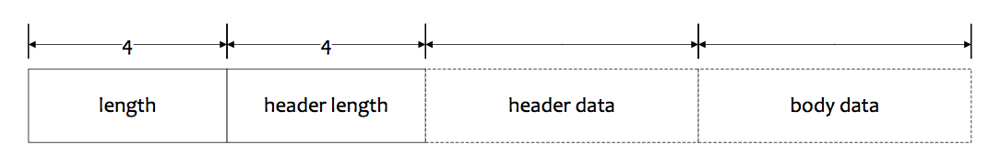

# RocketMQ 通信

RocketMQ中的通信是基于**Netty 4.0.36.Final**，在其上作了一些网络消息封装(即**协议**)，再加上相应的**序列化方式**，即可作**RPC**调用。

### 通信协议

RocketMQ中的协议格式，如下图所示：




其实现主要在[Remote](../remoting)模块中，协议通过[RemotingCommand](../remoting/src/main/java/org/apache/rocketmq/remoting/protocol/RemotingCommand.java)类体现，请求(**Request**)和响应(**Response**)均会使用该类：

```java
public class RemotingCommand {

	///// 以下为请求头字段
	
	/**
	 * 请求码，
	 */
	private int code;
	
	/**
	 * 语言类型，可为后期做一些语言特性处理或兼容
	 */
	private LanguageCode language = LanguageCode.JAVA;
	
	/**
	 * 版本号
	 */
	private int version = 0;
	
	/**
	 * 请求ID
	 */
	private int opaque = requestId.getAndIncrement();
	
	/**
	 * 标记
	 */
	private int flag = 0;
	
	/**
	 * 备注
	 */
	private String remark;
	
	/**
	 * 扩展字段
	 */
	private HashMap<String, String> extFields;
	
	/**
	 * 序列化类型，默认为JSON
	 */
	private SerializeType serializeTypeCurrentRPC = serializeTypeConfigInThisServer;
	
	/**
	 * 不同请求类型特性的Header类，序列化时会将对象字段放入extFields
	 */
	private transient CommandCustomHeader customHeader;
	    

	//// 请求body数据
	private transient byte[] body;
	
	// ...
}

```

如上述代码片段，除了`customHeader`和`body`被`transient`修饰，其他字段均可序列化，请求头字段概述：

header字段名    |  Request      | Response
-------------  | ------------- | -------------
code  | 请求操作码，请求接收方根据该值做不同的操作 | 应答结果码，0表示成功，非0表示各种错误码
language  | 请求方实现语言，默认JAVA | 应答接收方实现语言
version  | 请求发起方程序版本 | 应答接收方程序版本
opaque | 标识一次请求，可用于异步处理 | 应答方不做修改，直接返回
flag | 通信标志位，如RPC类型 | 通信标志位，如RPC类型
remark | 自定义文本信息 | 错误详细描述信息
extFields | 各类请求的自定义字段 | 各类响应的自定义字段

### 协议编码与解码(codec)

请求/响应命令编码与解码均在`RemotingCommand`中实现。

#### 协议编码(encode)

**协议编码**主要在`RemotingCommand`的`encode`方法中实现：

```java
// RemotingCommand.java
public ByteBuffer encode() {

    // 计算整个command需要的字节数
    // header数据长度需要4个字节
    int length = 4;

    // 编码header
    byte[] headerData = this.headerEncode();
    // header真实数据字节数
    length += headerData.length;

    // 3> body真实数据字节数
    if (this.body != null) {
        length += body.length;
    }

    // 申请缓冲区，加上的4个字节用于存放数据总长度
    ByteBuffer result = ByteBuffer.allocate(4 + length);

    // 放入数据总长度
    result.putInt(length);

    // header length = 序列化类型(1 byte) + header数据长度(3 byte)
    // 注意，这里存放header长度的4个字节中，第1个字节存放了序列化类型，剩下3个字节存放header的数据长度，
    // 即header数据长度最大为2^24，即16M
    result.put(markProtocolType(headerData.length, serializeTypeCurrentRPC));

    // 放入header数据
    result.put(headerData);

    // 放入body数据
    if (this.body != null) {
        result.put(this.body);
    }

    // 将ByteBuffer切换到读模式
    result.flip();

    return result;
}

// 编码header数据
private byte[] headerEncode() {

    // 将定制header放入extFields
    this.makeCustomHeaderToNet();

    if (SerializeType.ROCKETMQ == serializeTypeCurrentRPC) {
        // ROCKETMQ序列化
        return RocketMQSerializable.rocketMQProtocolEncode(this);
    } else {
        // JSON序列化
        return RemotingSerializable.encode(this);
    }
}

// 设置扩展头字段
public void makeCustomHeaderToNet() {

    if (this.customHeader != null) {
        // 反射获取请求命令对象自定义的字段
        Field[] fields = getClazzFields(customHeader.getClass());
        if (null == this.extFields) {
            this.extFields = new HashMap<String, String>();
        }

        for (Field field : fields) {
            // 取非static的字段
            if (!Modifier.isStatic(field.getModifiers())) {
                String name = field.getName();
                if (!name.startsWith("this")) {
                    // 非this开头的字段
                    Object value = null;
                    try {
                        field.setAccessible(true);
                        value = field.get(this.customHeader);
                    } catch (IllegalArgumentException e) {
                    } catch (IllegalAccessException e) {
                    }

                    if (value != null) {
                        // 非空，则放入扩展字段
                        this.extFields.put(name, value.toString());
                    }
                }
            }
        }
    }
}

// 设置序列化类型
public static byte[] markProtocolType(int source, SerializeType type) {

    byte[] result = new byte[4];

    // e.g. source = 100 (00000000 00000000 00000000 1100100)

    result[0] = type.getCode();
    result[1] = (byte) ((source >> 16) & 0xFF);
    result[2] = (byte) ((source >> 8) & 0xFF);
    result[3] = (byte) (source & 0xFF);

    // [00000000, 00000000, 00000000, 1100100]
    return result;
}
```

#### 协议解码(decode)

**协议解码**主要在`RemotingCommand`的`decode`方法中实现：

```java
// RemotingCommand.java
public static RemotingCommand decode(final ByteBuffer byteBuffer) {

    // 数据总长度
    int length = byteBuffer.limit();

    // 序列化类型字节(1 byte) + header长度(3 byte)
    int oriHeaderLen = byteBuffer.getInt();

    // 获取header长度
    int headerLength = getHeaderLength(oriHeaderLen);

    byte[] headerData = new byte[headerLength];
    // 填充header数据
    byteBuffer.get(headerData);

    // 反序列化header数据，并构建RemotingCommand对象
    RemotingCommand cmd = headerDecode(headerData, getProtocolType(oriHeaderLen));

    // body长度
    int bodyLength = length - 4 - headerLength;
    byte[] bodyData = null;
    if (bodyLength > 0) {
        bodyData = new byte[bodyLength];
        // 填充body数据
        byteBuffer.get(bodyData);
    }
    cmd.body = bodyData;

    return cmd;
}

// 获取header真实长度
public static int getHeaderLength(int length) {
    return length & 0xFFFFFF;
}

// 获取序列化类型
public static SerializeType getProtocolType(int source) {
    return SerializeType.valueOf((byte) ((source >> 24) & 0xFF));
}

// 反序列化header，并构建RemotingCommand
private static RemotingCommand headerDecode(byte[] headerData, SerializeType type) {
    switch (type) {
        case JSON:
            // JSON反序列化
            RemotingCommand resultJson = RemotingSerializable.decode(headerData, RemotingCommand.class);
            resultJson.setSerializeTypeCurrentRPC(type);
            return resultJson;
        case ROCKETMQ:
            // RocketMQ反序列化
            RemotingCommand resultRMQ = RocketMQSerializable.rocketMQProtocolDecode(headerData);
            resultRMQ.setSerializeTypeCurrentRPC(type);
            return resultRMQ;
        default:
            break;
    }

    return null;
}
```

<font color="red">注意</font>：在`decode`时，并没有获取对应`encode`后第一个字节(即**数据总长度**)，这是因为**RocketMQ**在使用Netty通信时，定制了解码器[NettyDecoder](../remoting/src/main/java/org/apache/rocketmq/remoting/netty/NettyDecoder.java)，该类继承自**LengthFieldBasedFrameDecoder**(该Decoder很适合用于解析header中含有数据长度的二进制消息)，并且可见其初始化为：

```java
// NettyDecoder.java
public class NettyDecoder extends LengthFieldBasedFrameDecoder {
	
    public NettyDecoder() {
        // 设置前4个字节表示数据总长度，并从第5个字节开始截取数据，并填充buffer
        super(FRAME_MAX_LENGTH, 0, 4, 0, 4);
    }
}
```

### 序列化与反序列化

由上文可知，RocketMQ中支持两种序列化：**JSON**和**ROCKETMQ**。

#### JSON

**JSON**序列化使用的是**fastjson 1.2.29**。

#### ROCKETMQ

**ROCKETMQ**是自定义的一套序列化方式，具体实现可见类[RocketMQSerializable](../remoting/src/main/java/org/apache/rocketmq/remoting/protocol/RocketMQSerializable.java)，格式如图所示：

